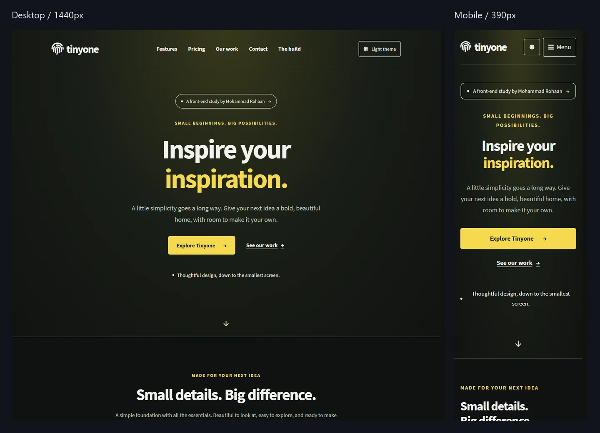

# Tinyone · Responsive front-end study

A recreation of the original Tinyone template by **Mohammad Rohaan**, refined into a responsive, accessible, interactive portfolio demonstration.

## 🚀 Live Demo

[https://rohaan2802.github.io/WebTinyOne/](https://rohaan2802.github.io/WebTinyOne/)

[Design decisions](CASE_STUDY.md) · [Verification notes](RESPONSIVE_QA.md)


## A quick review

1. Resize the page: content grids and navigation adapt to available space.
2. Switch between dark and light themes, then reload to check the saved preference.
3. Filter the work gallery and open an image. Try arrow keys, Tab, and Escape.
4. Read **The build** section for project scope and implementation decisions.
5. Enable reduced motion in your operating system: reveals and hover movement stop.

## What this project demonstrates

- **Responsive composition:** fluid headings, 18px baseline reading type, generous line spacing, and bounded reading widths. Navigation collapses before links become crowded.
- **Interaction design:** persistent theme preference, gallery filters, accessible image viewing, back-to-top, reading progress, active section indication, and native expandable project details.
- **Considered motion:** short one-time entrance/reveal animations and restrained hover feedback. Content is visible without animation or JavaScript; no continuous animation loop is required.
- **Progressive enhancement:** no-JavaScript navigation and image links, a storage-blocked theme fallback, visible keyboard focus, and reduced-motion handling.
- **Maintainable delivery:** plain HTML, CSS, and JavaScript with local assets, no framework runtime or application build step, and an included browser regression check.

## Run locally

From the repository root:

```sh
python -m http.server 5500
```

Open http://localhost:5500. A static hosting service can serve the same files directly.

## Source map

| File | Responsibility |
| --- | --- |
| `index.html` | Semantic page, portfolio content, project notes, and native FAQ |
| `css/style.css` | Base layout and original light palette |
| `css/enhancements.css` | Dark palette, theme controls, gallery, and image viewer |
| `css/presentation.css` | Larger typography, project section, and presentation effects |
| `theme-init.js` | Applies the saved theme before styles render |
| `script.js` | Navigation and local demo-form validation |
| `enhancements.js` | Theme switch, filters, image viewer, and back-to-top |
| `presentation.js` | Cancellable motion, reading progress, and current-section tracking |
| `tests/responsive_check.py` | Layout and interaction regression checks |

## Verification

The browser regression check covers **24 widths from 240px to 3840px in both themes**, plus landscape, enlarged text, gallery keyboard behavior, theme persistence, native FAQ, reduced motion, and no-JavaScript navigation. See [the test notes](RESPONSIVE_QA.md) for exact scope and limitations.

```sh
python -m pip install playwright
python tests/responsive_check.py
```

An installed Google Chrome browser is required by default. Set `BROWSER_CHANNEL=msedge` to use an installed Microsoft Edge browser. Screenshots and results are written to the ignored `tests/artifacts/` directory.

## Attribution and scope

This is an independent front-end study of an existing template, not a claim of an original commercial product or a shipped client project. Original imagery, fonts, and design attribution are retained. Review their respective licenses before commercial reuse.

Team, portfolio, pricing, statistics, and testimonial content is illustrative. Contact and newsletter forms validate locally, but do not send or store submissions; production use needs a backend or form service. No analytics, checkout, or performance score is claimed. The tests do not certify every physical device or assistive technology.
