# Tinyone · Responsive front-end study

A polished recreation of the classic **Tinyone** one-page template by **Mohammad Rohaan**, rebuilt as an accessible, interactive, portfolio-ready front-end demonstration. The project keeps the original creative direction while adding theme switching, gallery tools, keyboard-friendly image viewing, motion controls, and documented verification.

## LIVE DEMO

https://rohaan2802.github.io/WebTinyOne/

Related docs: [CASE_STUDY.md](CASE_STUDY.md) · [RESPONSIVE_QA.md](RESPONSIVE_QA.md)

---

## Feature screenshots

Below are **15 desktop feature screenshots**. Each crop focuses on one capability (not full-page mobile frames).

### 1. Hero landing

Full first viewport: brand header, eyebrow, headline, supporting copy, primary/secondary CTAs, and scroll cue.

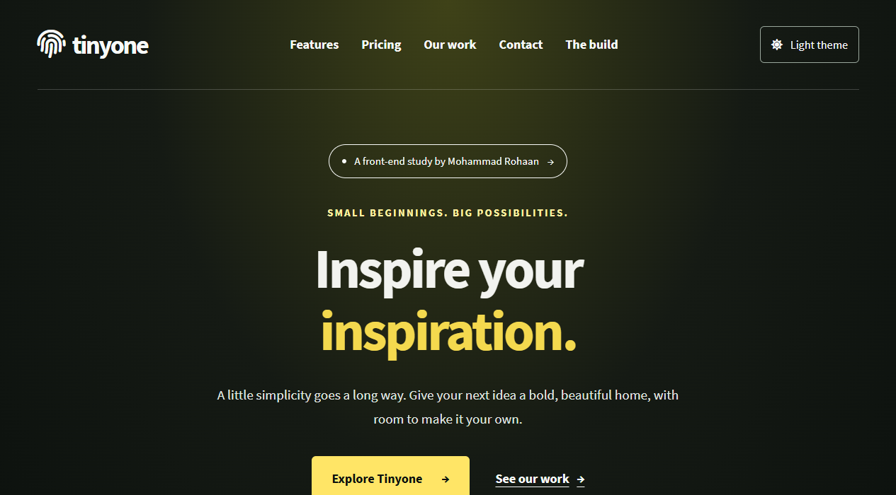

### 2. Navigation and theme toggle

Main nav links (Features, Pricing, Our work, Contact, The build) plus the light/dark theme control.

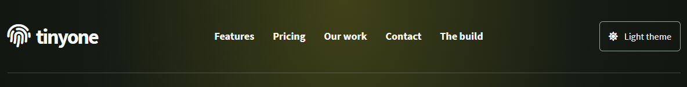

### 3. Features section

Icon + copy cards explaining responsive layout, HTML5 foundations, creativity, and accessibility-minded structure.

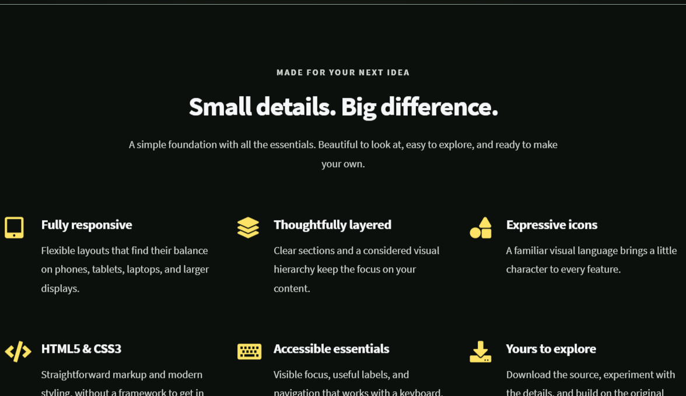

### 4. Pricing plans

Three illustrative plans with featured emphasis, pricing figures, plan bullets, and contact CTAs.

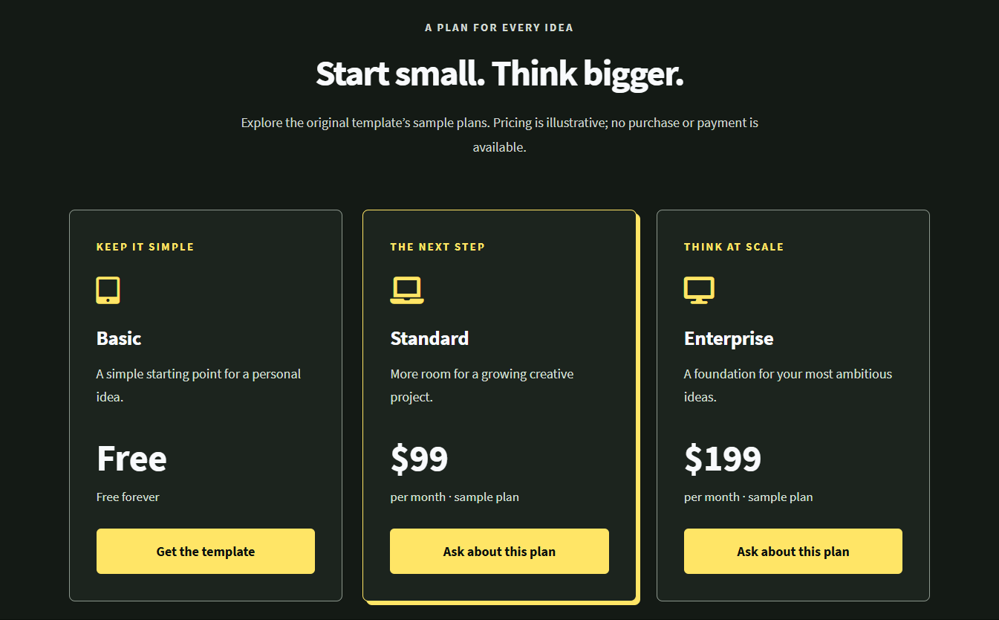

### 5. Work gallery

Portfolio grid with category filters and project cards ready for image viewing.

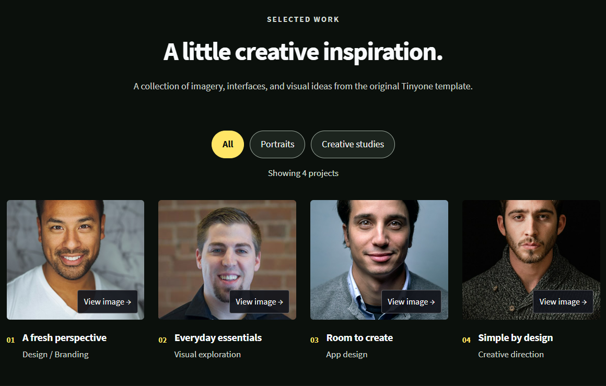

### 6. Gallery filter (active)

Clicking **Portraits** (or another category) updates `aria-pressed`, status text, and visible cards only.

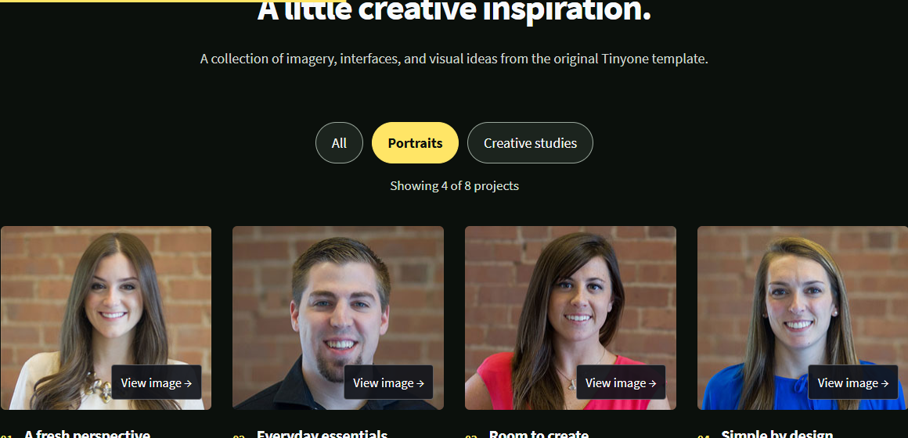

### 7. Accessible image viewer

Opening a project preview launches a `<dialog>` image viewer with title, position, previous/next, and Escape/Close.

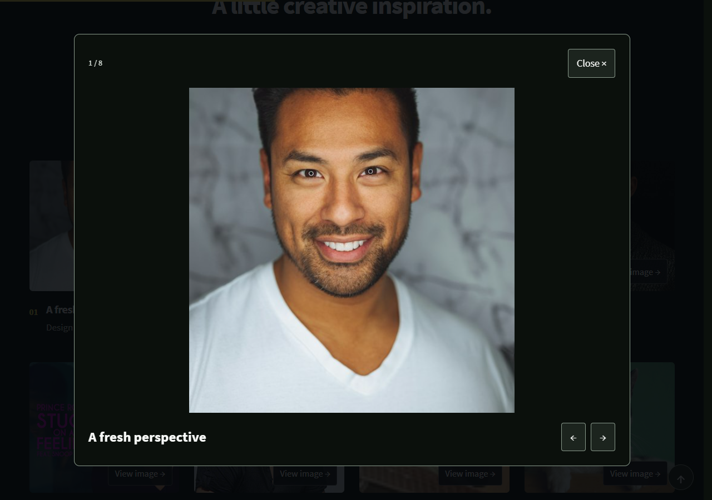

### 8. Team section

Sample people cards with portrait, name, role, and short bio (illustrative template content).

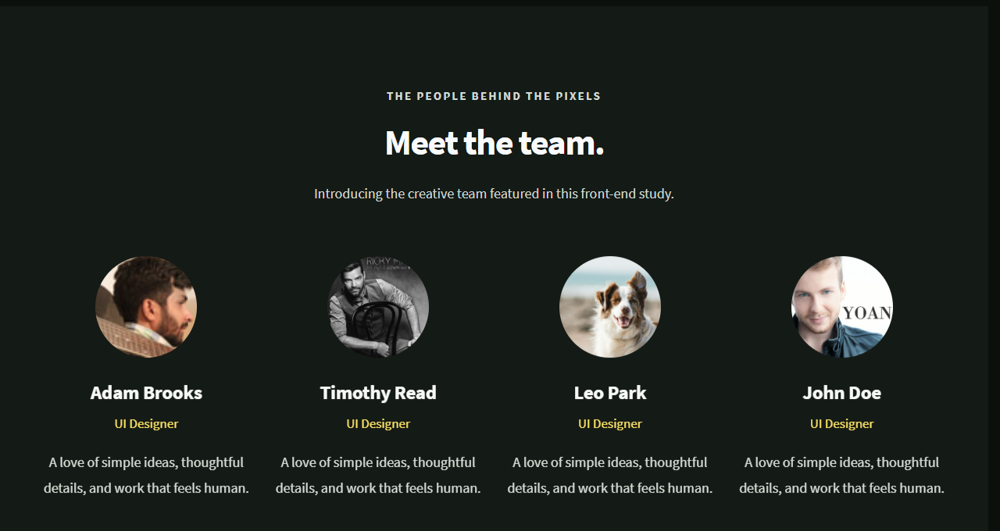

### 9. Story and statistics

Demonstration stats strip (products, hours, customers, ideas) under the story heading.

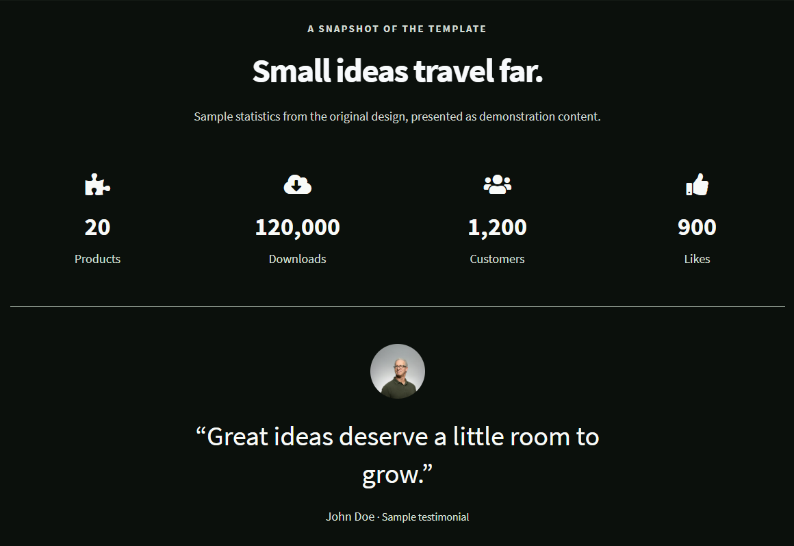

### 10. Contact form

Contact details beside a local demo form (name, email, message) with client-side validation feedback.

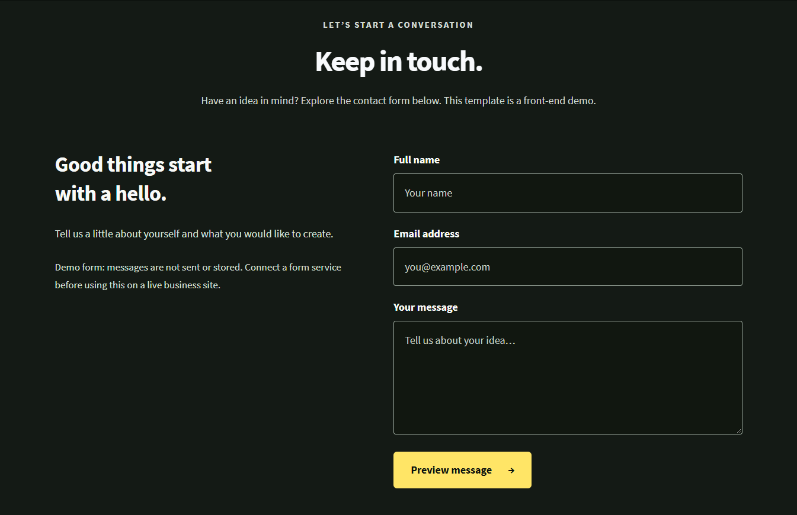

### 11. Project notes (The build)

Portfolio-facing project narrative: scope, stack, interaction goals, and source links.

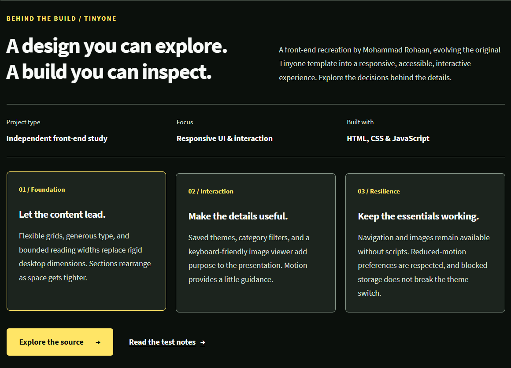

### 12. Native FAQ details

Expandable `<details>` / `<summary>` FAQ for scope, testing, and how to run the project—no custom accordion library.

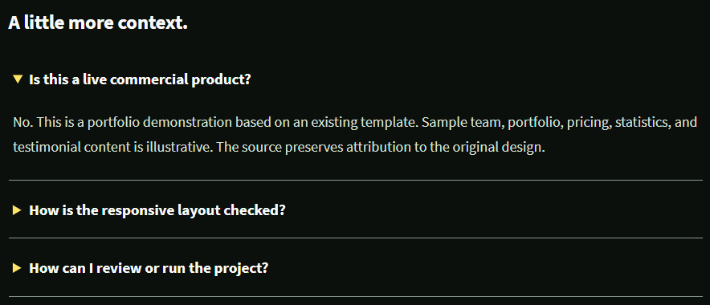

### 13. Reading progress and back-to-top

Scroll-linked reading progress bar at the top and a back-to-top control after scrolling.

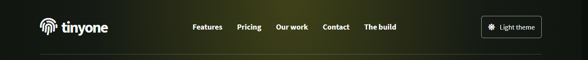

### 14. Light theme hero

Same landing composition with the high-contrast light palette (saved preference restores on reload).

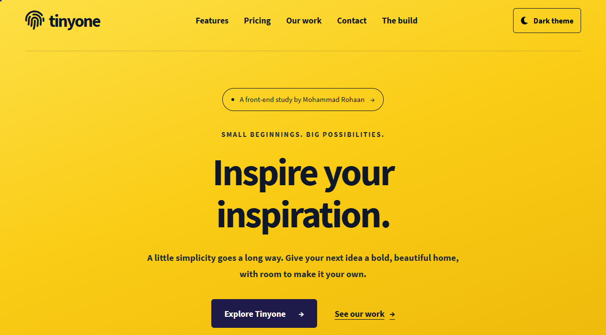

### 15. Footer and newsletter

Footer brand, nav, attribution, and newsletter demo field with local validation only.

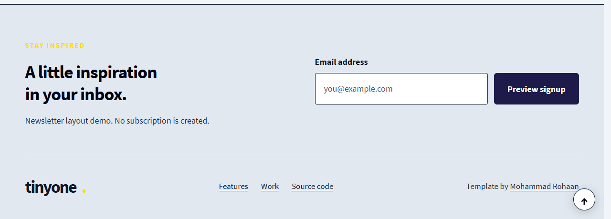

---

## Overview

Tinyone is a **static** HTML/CSS/JavaScript site. There is no framework runtime and no application build step for the public page. The goal is to show:

- Clean semantic structure
- Responsive composition across widths
- Thoughtful interaction (theme, filters, viewer, progress)
- Progressive enhancement when JavaScript or storage is limited
- Portfolio documentation that explains what was built and why

Sample team, pricing, statistics, and testimonial copy is **illustrative**. Forms validate in the browser but do not send or store submissions.

---

## Features explained in depth

### Responsive composition

Layouts use fluid type (`clamp`), flexible grids, and a wrapping header. Navigation collapses into a menu control before links become cramped. Images stay max-width constrained. Content is not locked into fixed viewport heights that clip on short screens.

### Dark and light themes

- Default theme is **dark**
- Toggle switches `data-theme` on `<html>`
- Preference is saved in `localStorage` under `WebTinyOne-theme`
- `theme-init.js` applies the saved theme **before** paint to reduce flash
- If storage is blocked, the site still runs with the default theme
- Both themes use stronger contrast for text, borders, buttons, inputs, and filters

### Work gallery filters

Filter buttons use `aria-pressed` and a live status region. Categories include All, Portraits, and Creative studies. Filtering is client-side only and keeps keyboard focus usable.

### Image viewer (`<dialog>`)

Project previews open a native dialog viewer with:

- Current image and title
- Position indicator (for example 1 of 8)
- Previous / next controls
- Close button and Escape
- Click-outside-to-close behavior
- Body scroll lock while open

Without JavaScript, preview links still behave as normal image links.

### Reading progress

A thin bar tracks scroll depth through the page. It is decorative (`aria-hidden`) and updates from `presentation.js`.

### Back to top

After scrolling, a control returns focus-friendly navigation to the top of the page.

### Active section indication

As the user scrolls, presentation logic can highlight the current section context for orientation (paired with smooth scrolling and scroll padding).

### Native FAQ / project notes

The **The build** section documents the study and uses native `<details>` elements so FAQ content works without a custom JS accordion.

### Considered motion

Entrance/reveal motion is short and cancellable. When the OS requests reduced motion, reveals and hover movement settle so content remains usable without animation.

### Demo forms

Contact and newsletter forms:

- Validate locally
- Surface status messages with `aria-live`
- Do **not** POST to a server
- Need a backend or form service for production use

### Progressive enhancement

- Skip link to main content
- Visible keyboard focus
- No-JS navigation and image links still work
- Theme fallback when `localStorage` throws
- Reduced-motion path when preferred

---

## Tech stack

| Layer | Choice |
| --- | --- |
| Markup | Semantic HTML5 |
| Styling | Plain CSS (`style.css`, `enhancements.css`, `presentation.css`) |
| Behavior | Vanilla JavaScript modules/scripts |
| Assets | Local fonts, icons (Font Awesome), and images |
| Hosting | GitHub Pages |
| Checks | Playwright-driven Python regression script |

---

## Source map

| File | Responsibility |
| --- | --- |
| `index.html` | Page structure, sections, FAQ, dialog viewer shell |
| `css/style.css` | Base layout, light palette tokens, grids |
| `css/enhancements.css` | Theme system, gallery tools, viewer, high-contrast overrides |
| `css/presentation.css` | Presentation typography and motion-related polish |
| `theme-init.js` | Early theme application from storage |
| `script.js` | Navigation menu + demo form validation |
| `enhancements.js` | Theme toggle, filters, image viewer, back-to-top |
| `presentation.js` | Reveals, reading progress, section awareness, FAQ motion hooks |
| `docs/screenshots/` | Feature screenshots used in this README |
| `tests/responsive_check.py` | Multi-width / theme regression checks |
| `CASE_STUDY.md` | Design decisions |
| `RESPONSIVE_QA.md` | Verification notes and limits |

---

## Run locally

From the repository root:

```sh
python -m http.server 5500
```

Open http://localhost:5500

Any static host can serve the same files. For GitHub Pages, the live URL is listed under **LIVE DEMO** above.

---

## Verification

The browser regression check covers **24 widths from 240px to 3840px in both themes**, plus landscape, enlarged text, gallery keyboard behavior, theme persistence, native FAQ, reduced motion, and no-JavaScript navigation. See [RESPONSIVE_QA.md](RESPONSIVE_QA.md).

```sh
python -m pip install playwright
python tests/responsive_check.py
```

Chrome is the default channel. Set `BROWSER_CHANNEL=msedge` to use Edge. Artifacts write to ignored `tests/artifacts/`.

Optional local screenshot helper used for this README:

```sh
node scripts/capture-feature-shots.mjs
```

---

## Attribution and scope

This is an independent front-end study of an existing template, not a claim of an original commercial product or a shipped client project. Original imagery, fonts, and design attribution are retained—review licenses before commercial reuse.

No analytics, checkout, or performance score is claimed. Tests do not certify every physical device or assistive technology.

---

## Author

**Mohammad Rohaan** · [GitHub](https://github.com/rohaan2802)

Repository: https://github.com/rohaan2802/WebTinyOne
